# ICT Trading Bot — Database ER Diagram

## Entity Relationship Diagram (Mermaid)

```mermaid
erDiagram
    tickers ||--o{ trades : "traded as"
    tickers ||--o{ thread_status : "scanned by"
    trades ||--o{ trade_closes : "has partial closes"
    trades ||--o{ trade_commands : "receives commands"
    trades ||--o{ errors : "may have errors"
    thread_status ||--o{ errors : "may log errors"
    bot_state ||--|| bot_state : "singleton"
    settings ||--|| settings : "key-value config"
    system_log ||--|| system_log : "append-only log"

    tickers {
        serial id PK "GENERATED ALWAYS AS IDENTITY"
        varchar_10 symbol "NOT NULL UNIQUE"
        varchar_100 name "NULL"
        boolean is_active "NOT NULL DEFAULT TRUE"
        int contracts "NOT NULL DEFAULT 2, CHECK > 0"
        text notes "NULL"
        timestamptz created_at "NOT NULL DEFAULT NOW()"
        timestamptz updated_at "NOT NULL DEFAULT NOW()"
    }

    settings {
        serial id PK "GENERATED ALWAYS AS IDENTITY"
        varchar_30 category "NOT NULL (broker/strategy/exit_rules/trade_window/email/webhook/general)"
        varchar_50 key "NOT NULL UNIQUE"
        text value "NOT NULL"
        varchar_20 data_type "NOT NULL DEFAULT 'string' (string/int/float/bool)"
        text description "NULL"
        boolean is_secret "NOT NULL DEFAULT FALSE"
        timestamptz created_at "NOT NULL DEFAULT NOW()"
        timestamptz updated_at "NOT NULL DEFAULT NOW()"
    }

    trades {
        serial id PK "GENERATED ALWAYS AS IDENTITY"
        varchar_20 account "NOT NULL, INDEX"
        varchar_10 ticker "NOT NULL, INDEX"
        varchar_40 symbol "NOT NULL"
        varchar_5 direction "NOT NULL DEFAULT 'LONG', CHECK (direction IN ('LONG','SHORT'))"
        int contracts_entered "NOT NULL"
        int contracts_open "NOT NULL"
        int contracts_closed "NOT NULL DEFAULT 0"
        numeric_10_4 entry_price "NOT NULL"
        numeric_10_4 exit_price "NULL (set on close)"
        numeric_10_4 current_price "NULL (updated every 5s)"
        numeric_10_4 ib_fill_price "NULL (actual IB fill)"
        int ib_order_id "NULL"
        bigint ib_perm_id "NULL (IB permanent ID)"
        bigint ib_tp_perm_id "NULL (TP order perm ID)"
        bigint ib_sl_perm_id "NULL (SL order perm ID)"
        bigint ib_con_id "NULL (IB contract ID for reconciliation)"
        numeric_8_4 pnl_pct "DEFAULT 0"
        numeric_12_4 pnl_usd "DEFAULT 0"
        numeric_8_4 peak_pnl_pct "DEFAULT 0"
        numeric_8_4 dynamic_sl_pct "DEFAULT -0.60"
        numeric_10_4 profit_target "NOT NULL"
        numeric_10_4 stop_loss_level "NOT NULL"
        varchar_40 signal_type "NULL"
        numeric_10_4 ict_entry "NULL"
        numeric_10_4 ict_sl "NULL"
        numeric_10_4 ict_tp "NULL"
        timestamptz entry_time "NOT NULL"
        timestamptz exit_time "NULL"
        varchar_10 status "NOT NULL DEFAULT 'open', CHECK (status IN ('open','closed','errored')), INDEX"
        varchar_40 exit_reason "NULL"
        varchar_10 exit_result "NULL, CHECK (exit_result IN ('WIN','LOSS','SCRATCH'))"
        text error_message "NULL"
        jsonb entry_enrichment "DEFAULT '{}'"
        jsonb exit_enrichment "DEFAULT '{}'"
        timestamptz created_at "NOT NULL DEFAULT NOW()"
        timestamptz updated_at "NOT NULL DEFAULT NOW()"
    }

    trade_closes {
        serial id PK "GENERATED ALWAYS AS IDENTITY"
        int trade_id FK "NOT NULL REFERENCES trades(id)"
        int contracts "NOT NULL, CHECK (contracts > 0)"
        numeric_10_4 close_price "NOT NULL"
        numeric_8_4 pnl_pct "NOT NULL"
        numeric_12_4 pnl_usd "NOT NULL"
        varchar_40 reason "NOT NULL"
        int ib_order_id "NULL"
        numeric_10_4 ib_fill_price "NULL"
        timestamptz closed_at "NOT NULL DEFAULT NOW()"
    }

    trade_commands {
        serial id PK "GENERATED ALWAYS AS IDENTITY"
        int trade_id FK "NOT NULL REFERENCES trades(id)"
        varchar_20 command "NOT NULL, CHECK (command IN ('close','close_partial','close_all'))"
        int contracts "NULL (NULL = close all)"
        varchar_20 status "NOT NULL DEFAULT 'pending', CHECK (status IN ('pending','executing','executed','failed')), INDEX"
        text error "NULL"
        timestamptz created_at "NOT NULL DEFAULT NOW()"
        timestamptz executed_at "NULL"
    }

    thread_status {
        serial id PK "GENERATED ALWAYS AS IDENTITY"
        varchar_30 thread_name "NOT NULL UNIQUE"
        varchar_10 ticker "NULL"
        varchar_20 status "NOT NULL DEFAULT 'idle'"
        int pid "NULL (OS process ID)"
        bigint thread_id "NULL (Python thread ID)"
        timestamptz last_scan_time "NULL"
        text last_message "NULL"
        int scans_today "DEFAULT 0"
        int trades_today "DEFAULT 0"
        int alerts_today "DEFAULT 0"
        int error_count "DEFAULT 0"
        timestamptz created_at "NOT NULL DEFAULT NOW()"
        timestamptz updated_at "NOT NULL DEFAULT NOW() (heartbeat)"
    }

    bot_state {
        int id PK "DEFAULT 1 CHECK (id = 1)"
        varchar_20 status "NOT NULL DEFAULT 'stopped'"
        varchar_20 account "NULL"
        int pid "NULL"
        int total_tickers "DEFAULT 0"
        boolean scans_active "DEFAULT FALSE"
        boolean stop_requested "DEFAULT FALSE"
        boolean ib_connected "DEFAULT FALSE"
        text last_error "NULL"
        timestamptz started_at "NULL"
        timestamptz stopped_at "NULL"
        timestamptz updated_at "NOT NULL DEFAULT NOW()"
    }

    system_log {
        serial id PK "GENERATED ALWAYS AS IDENTITY"
        varchar_30 component "NOT NULL, INDEX"
        varchar_10 level "NOT NULL DEFAULT 'info', CHECK IN ('info','warn','error','debug')"
        text message "NOT NULL"
        jsonb details "DEFAULT '{}' (traceback, error_type, context)"
        timestamptz created_at "NOT NULL DEFAULT NOW(), INDEX DESC"
    }

    errors {
        serial id PK "GENERATED ALWAYS AS IDENTITY"
        varchar_30 thread_name "NULL"
        varchar_10 ticker "NULL"
        int trade_id FK "NULL REFERENCES trades(id)"
        varchar_50 error_type "NOT NULL"
        text message "NOT NULL"
        text traceback "NULL"
        timestamptz created_at "NOT NULL DEFAULT NOW(), INDEX"
    }
```



## Table Descriptions

### trades (core table)
- **Purpose**: Central trade lifecycle table. A row is INSERT'd at entry, UPDATE'd every 5 seconds with live pricing, and finalized on exit.
- **Relationships**: One-to-many with trade_closes, trade_commands, errors
- **Key behavior**: `contracts_open` decremented on partial closes, `status` transitions: open → closed | errored
- **JSONB columns**: `entry_enrichment` stores Greeks, indicators, VIX, stock price at entry; `exit_enrichment` stores same at exit. Avoids 40+ rigid columns.

### trade_closes (partial close audit trail)
- **Purpose**: Each partial close event gets a row. Enables tracking "closed 1 of 3 contracts at $2.50, then 2 more at $2.80".
- **Relationship**: Many-to-one with trades (trade_id FK)

### trade_commands (UI → bot command channel)
- **Purpose**: The dashboard API cannot call IB directly (IB event loop is on bot's main thread). Instead, the API writes a command row; the bot polls every 5 seconds and executes.
- **Lifecycle**: pending → executing → executed | failed

### thread_status (scanner monitoring)
- **Purpose**: Each scanner thread UPSERTs its row on every scan cycle. Dashboard reads for the Threads tab.
- **Unique constraint**: One row per thread_name (UPSERT pattern)

### bot_state (singleton)
- **Purpose**: Single row tracking whether the bot process is running. Dashboard reads for Start/Stop UI.
- **Constraint**: `CHECK (id = 1)` ensures only one row

### errors (error log)
- **Purpose**: Persistent error log queryable by the dashboard. Supplements bot.log with structured data.

## Indexes

| Table | Index | Columns | Purpose |
|-------|-------|---------|---------|
| trades | idx_trades_status | status | Filter open/closed trades |
| trades | idx_trades_account | account | Multi-account support |
| trades | idx_trades_ticker | ticker | Filter by ticker |
| trades | idx_trades_entry_time | entry_time | Sort/filter by date |
| trades | idx_trades_account_status | account, status | Dashboard main query |
| trades | idx_trades_account_date | account, entry_time DESC | Daily P&L queries |
| trade_closes | idx_trade_closes_trade_id | trade_id | Join with trades |
| trade_commands | idx_trade_commands_status | status | Bot polls for pending |
| trade_commands | idx_trade_commands_trade_id | trade_id | Join with trades |
| thread_status | uq_thread_status_name | thread_name (UNIQUE) | UPSERT target |
| errors | idx_errors_created_at | created_at DESC | Recent errors query |
| errors | idx_errors_trade_id | trade_id | Errors for a specific trade |
| errors | idx_errors_ticker | ticker | Errors by ticker |

## Sequences

| Sequence | Table | Column |
|----------|-------|--------|
| trades_id_seq | trades | id (GENERATED ALWAYS AS IDENTITY) |
| trade_closes_id_seq | trade_closes | id |
| trade_commands_id_seq | trade_commands | id |
| thread_status_id_seq | thread_status | id |
| errors_id_seq | errors | id |

## Triggers

| Trigger | Table | Event | Action |
|---------|-------|-------|--------|
| trg_trades_updated_at | trades | BEFORE UPDATE | SET updated_at = NOW() |
| trg_thread_status_updated_at | thread_status | BEFORE UPDATE | SET updated_at = NOW() |
| trg_bot_state_updated_at | bot_state | BEFORE UPDATE | SET updated_at = NOW() |

### Trigger Function
```sql
CREATE OR REPLACE FUNCTION update_updated_at()
RETURNS TRIGGER AS $$
BEGIN
    NEW.updated_at = NOW();
    RETURN NEW;
END;
$$ LANGUAGE plpgsql;
```

## Analytics Views (11 views, all Pacific Time)

All views are defined in `db/analytics_views.sql`. They convert UTC to PT and provide pre-aggregated data for the Analytics tab charts.

| View | Aggregation | Key Columns |
|------|-------------|-------------|
| `v_trades_analytics` | Base: all trades with PT timestamps | entry_time_pt, exit_time_pt, entry_hour, exit_hour, trade_date, contract_type, risk_capital, hold_minutes |
| `v_pnl_by_ticker` | P&L per ticker per date | ticker, total_trades, wins, losses, scratches, total_pnl, avg_pnl_pct, avg_hold_min |
| `v_pnl_by_exit_hour` | P&L by exit hour (PT) | hour, trades, pnl |
| `v_pnl_by_entry_hour` | P&L by entry hour (PT) | hour, trades, pnl |
| `v_risk_by_hour` | Risk capital by entry hour | hour, capital, contracts |
| `v_contracts_by_hour` | Contracts opened by hour | hour, contracts |
| `v_pnl_by_contract_type` | Calls vs Puts | contract_type, trades, pnl, wins, losses |
| `v_pnl_by_exit_reason` | P&L by exit reason | exit_reason, exit_result, trades, pnl |
| `v_daily_summary` | Daily account-level rollup | trade_date, account, total/open/closed, wins/losses, win_rate, risk_capital, avg_hold_min |
| `v_pnl_by_day_of_week` | Performance by day of week | day_num (1=Mon), day_name, trades, wins, losses, total_pnl, avg_pnl, win_rate |
| `v_pnl_by_signal_type` | Performance by ICT signal | signal_type, trades, wins, losses, total_pnl, avg_pnl, win_rate |

## Data Flow

```
                    ┌─────────────┐
                    │  React UI   │
                    │  (browser)  │
                    └──────┬──────┘
                           │ Socket.IO + REST
                    ┌──────┴──────┐
                    │  FastAPI    │
                    │  (api:8000) │◄── reads trades, thread_status, errors, system_log
                    └──────┬──────┘    writes trade_commands
                           │
                    ┌──────┴──────┐
                    │ PostgreSQL  │
                    │ (pg:5432)   │
                    │ 8 tables +  │
                    │ 11 views    │
                    └──────┬──────┘
                           │
        ┌──────────────────┼──────────────────┐
        │                  │                  │
  ┌─────┴─────┐    ┌──────┴──────┐    ┌──────┴──────┐
  │ Scanner   │    │ ExitManager │    │ Bot Main    │
  │ Threads   │    │ Thread      │    │ Thread      │
  │ (×17)     │    │             │    │             │
  │           │    │ heartbeat   │    │ heartbeat   │
  │ Signal    │    │ every 5s    │    │ every 30s   │
  │ Engine    │    │             │    │             │
  │ + Trade   │    └─────────────┘    └─────────────┘
  │ Entry Mgr │    writes:             reads:
  └───────────┘    trades (UPDATE)     trade_commands
  writes:          trade_closes        bot_state
  thread_status    thread_status       writes:
  errors           errors              thread_status
  system_log       system_log          system_log
```
