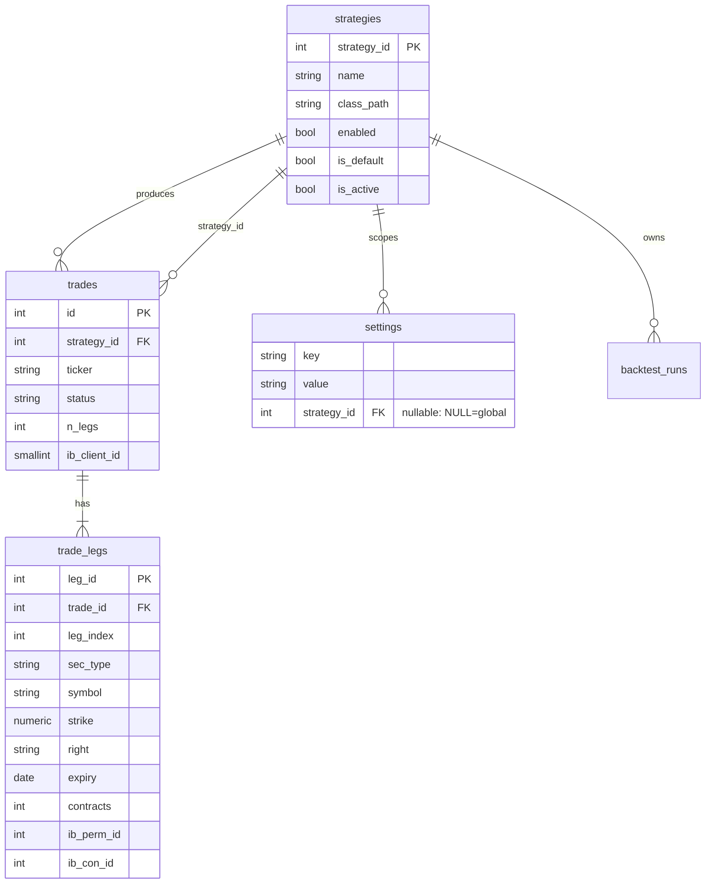
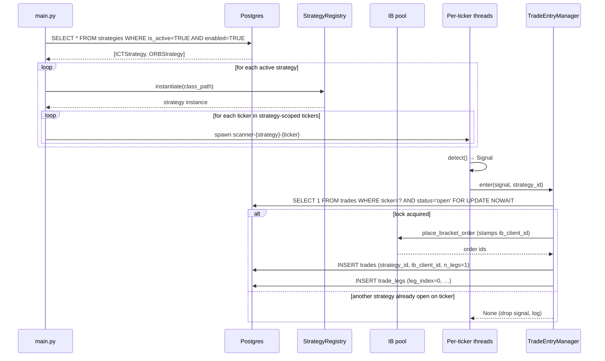
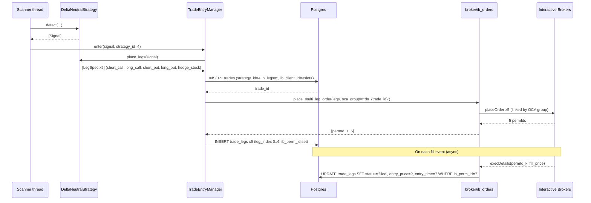

# Multi-Strategy Architecture v2 — Concurrent Strategies + Multi-Leg Trades

**Status:** Proposed target architecture.
**Supersedes near-term:** `docs/active_strategy_design.md` (singleton
`ACTIVE_STRATEGY`). **Reactivates & refines:** `docs/multi_strategy_data_model.md`
(which was deferred). **Prerequisite reading:**
`docs/strategy_plugin_framework.md`, `docs/ib_db_correlation.md` §11,
`docs/thread_owned_close.md`, `docs/close_flow_fixes_2026_04_21.md`,
`docs/delta_neutral_strategy.md`, `docs/ticker_thread_lifecycle.md`,
`docs/system_architecture.md`.

Branch: `feature/profitability-research`.

---

## §1 — Problem statement & goals

Today the bot runs exactly **one** strategy at a time (the `ACTIVE_STRATEGY`
setting), and every trade is a **single option leg**. That's fine for ICT.
It's wrong for:

- Running ICT alongside ORB on SPY concurrently, so we can compare them
  live on the same tape without stopping/starting the bot.
- Delta-neutral strategies (`docs/delta_neutral_strategy.md`) that place
  4 option legs (iron condor) or 4 options + 1 stock hedge.
- Per-strategy settings scoping in the UI (today's Settings tab is
  implicitly "for whatever ACTIVE_STRATEGY is").

### Done looks like

1. Multiple rows in `strategies` can be `is_active=TRUE AND enabled=TRUE`
   at the same time. The bot reads that set at boot and spawns per-ticker
   thread sets for each.
2. A `trade` row is the *logical deal*; its 1..N rows in `trade_legs`
   are the actual IB orders. Single-leg strategies keep working unchanged
   (backfilled into one `trade_legs` row).
3. Settings tab has a strategy dropdown; scoped settings shown as editable,
   globals shown as inherited.
4. Close flow routes through the pool slot (clientId) that placed the
   order, via `trades.ib_client_id` — concretely implementing the
   ARCH-007 "stable clientId routing" idea from
   `docs/ib_db_correlation.md` §11.

### Non-goals

- **Do not widen the tradeable universe.** Ticker list stays as-is.
- **Do not build new strategies in this doc.** ORB / VWAP / delta-neutral
  implementations are separate tracks.
- **Do not rewrite the backtest engine.** It already supports
  strategy-scoped runs via `backtest_runs.strategy_id`; the only
  multi-leg work there is teaching P&L aggregation to sum across legs
  (see §8).
- **Do not relax ARCH-005 / ARCH-006.** Both invariants survive
  intact; §3 extends them, doesn't weaken them.
- **Do not touch the IB connection pool sizing** (4 slots stays fine
  for Phase 2–5; revisit at Phase 6 only if N*M threads saturate the
  submit queue).

---

## §2 — Target data model

All changes ship in one migration: `db/migrations/007_multi_strategy_v2.sql`.
Additive + one DELETE-then-rebuild for the `ACTIVE_STRATEGY` seeding
step. Fully reversible.

### 2.1 `strategies.is_active`

Replaces the singleton `ACTIVE_STRATEGY` setting.

```sql
ALTER TABLE strategies
    ADD COLUMN is_active BOOLEAN NOT NULL DEFAULT FALSE;

CREATE INDEX idx_strategies_is_active
    ON strategies(is_active) WHERE is_active = TRUE;
```

**Backfill** (single transaction, inside the migration):

```sql
-- Read whatever ACTIVE_STRATEGY currently points at, flip is_active=TRUE
-- for that one strategy, then drop the setting row.
UPDATE strategies s SET is_active = TRUE
 WHERE s.name = (
     SELECT value FROM settings
      WHERE key = 'ACTIVE_STRATEGY' AND strategy_id IS NULL
 );

DELETE FROM settings WHERE key = 'ACTIVE_STRATEGY';
```

If no `ACTIVE_STRATEGY` row exists (fresh install), the default row
(`is_default=TRUE`) should be activated instead; the migration guards
for both cases with a `COALESCE`-style fallback.

### 2.2 `trades` extensions

```sql
ALTER TABLE trades
    ADD COLUMN ib_client_id SMALLINT,             -- pool slot's clientId
    ADD COLUMN n_legs       SMALLINT NOT NULL DEFAULT 1;

CREATE INDEX idx_trades_strategy_status
    ON trades(strategy_id, status);
CREATE INDEX idx_trades_client_id
    ON trades(ib_client_id) WHERE ib_client_id IS NOT NULL;
```

`ib_client_id` is stamped at order placement with the clientId of the
pool connection that submitted the entry order (see
`broker/ib_pool.py:37-40` for the clientId assignment). `n_legs` is a
cached count for UI — avoids a subselect when rendering the Trades tab.

### 2.3 `trade_legs` (new)

A `trade` row is the deal; `trade_legs` rows are the orders. Schema
accommodates OPT/FOP **and** STK legs (stock hedge needs NULLable
`strike`/`right`/`expiry`).

```sql
CREATE TABLE trade_legs (
    leg_id        SERIAL PRIMARY KEY,
    trade_id      INT NOT NULL REFERENCES trades(id) ON DELETE CASCADE,
    leg_index     SMALLINT NOT NULL,       -- 0..N-1, order matters for display
    role          VARCHAR(24),             -- 'short_call','long_put','hedge_stock',etc.

    -- Contract identity
    sec_type      VARCHAR(4) NOT NULL,     -- 'OPT' | 'FOP' | 'STK'
    symbol        VARCHAR(40) NOT NULL,    -- local_symbol for OPT/FOP, ticker for STK
    strike        NUMERIC(12,4),           -- NULL for STK
    right         VARCHAR(1),              -- 'C'|'P'; NULL for STK
    expiry        DATE,                    -- NULL for STK
    multiplier    INT NOT NULL DEFAULT 100,

    -- Sizing & direction
    contracts     INT NOT NULL,            -- share count for STK legs
    side          VARCHAR(4) NOT NULL,     -- 'BUY'|'SELL' (entry side)

    -- IB correlation
    ib_order_id   INT,
    ib_perm_id    BIGINT,
    ib_con_id     INT,

    -- Execution state
    status        VARCHAR(20) NOT NULL DEFAULT 'pending',  -- pending|filled|cancelled|closed
    entry_price   NUMERIC(10,4),
    entry_time    TIMESTAMPTZ,
    exit_price    NUMERIC(10,4),
    exit_time     TIMESTAMPTZ,

    created_at    TIMESTAMPTZ NOT NULL DEFAULT NOW(),
    updated_at    TIMESTAMPTZ NOT NULL DEFAULT NOW(),

    UNIQUE (trade_id, leg_index)
);

CREATE INDEX idx_trade_legs_trade    ON trade_legs(trade_id);
CREATE INDEX idx_trade_legs_perm_id  ON trade_legs(ib_perm_id)
    WHERE ib_perm_id IS NOT NULL;
CREATE INDEX idx_trade_legs_con_id   ON trade_legs(ib_con_id)
    WHERE ib_con_id IS NOT NULL;
```

**Single-leg backfill** (same migration):

```sql
INSERT INTO trade_legs
    (trade_id, leg_index, role, sec_type, symbol, strike, right, expiry,
     contracts, side, ib_order_id, ib_perm_id, ib_con_id,
     status, entry_price, entry_time, exit_price, exit_time)
SELECT id, 0, 'primary',
       COALESCE(sec_type, 'OPT'),
       COALESCE(option_symbol, symbol, ticker),
       strike, right, expiration,
       contracts, direction_to_side(direction),
       ib_order_id, ib_perm_id, ib_con_id,
       CASE WHEN status IN ('open','closed','cancelled') THEN status ELSE 'filled' END,
       entry_price, entry_time, exit_price, exit_time
  FROM trades
 WHERE NOT EXISTS (SELECT 1 FROM trade_legs WHERE trade_id = trades.id);
```

After backfill, `trades.n_legs` is set to 1 for all existing rows
(the `DEFAULT 1` already covers this).

### 2.4 `backtest_trades.strategy_id` — verify, don't re-add

`backtest_runs.strategy_id` already exists (confirmed). The migration
checks `backtest_trades` for the column and adds it nullable with a
backfill-from-run if missing; otherwise no-op.

### 2.5 ER diagram



### 2.6 Migration strategy — rollback

The migration is a single file; rollback is a companion
`db/migrations/007_multi_strategy_v2_rollback.sql` that:

1. Drops `trade_legs` (cascades from `trades.id` won't fire because
   we're dropping the child outright).
2. Drops the new `trades` columns.
3. Drops `strategies.is_active` and re-inserts an `ACTIVE_STRATEGY`
   settings row derived from whichever `strategies.is_active=TRUE` row
   was most recently updated.

At every step the live bot can still operate on the single active
strategy — rollback is boring.

---

## §3 — Runtime architecture

### 3.1 Isolation model

Each active strategy gets its **own per-ticker thread set**. If ICT and
ORB are both active and the ticker universe is 23 symbols, that's 46
scanner threads. Simpler to reason about than multi-plugin-per-thread;
if the thread count later becomes a real cost we revisit.

The IB connection pool (4 slots: exit-mgr + 3 scanner slots A/B/C,
`broker/ib_pool.py:1-10`) is shared — scanner threads multiplex onto
scanner slots via the existing ticker→slot sharding. Per-strategy
isolation is **at the thread/logic layer**, not at the connection
layer.

### 3.2 Boot sequence



### 3.3 Concurrent-trade policy (ARCH-006 extension)

> **One open trade per ticker, globally, across all strategies.**

If ICT is already open on SPY, ORB is blocked from entering SPY until
ICT closes. This is the existing behavior (see
`strategy/exit_manager.py:99-121`) extended to the multi-strategy
context. First strategy to signal *and* acquire the row-level lock
wins; the loser gets `NOWAIT` back and tries again next cycle.

The enforcement query (ARCH-002 pattern):

```sql
SELECT 1 FROM trades
 WHERE ticker = :ticker AND status = 'open'
 FOR UPDATE NOWAIT;
```

No partial unique index; the live row-level lock is enough. We
explicitly reject the stronger `(ticker, strategy_id)` form from
`multi_strategy_data_model.md` §2 — the user wants first-to-signal-wins,
not multiple-open-per-ticker.

### 3.4 Close flow is strategy-agnostic

Trades are trades. `strategy/exit_executor.py:_execute_exit_sell_first`
(line 355) and `strategy/exit_manager.py`'s `_atomic_close` don't need
to know who opened the trade. They just:

1. Read `trades.ib_client_id` to pick the pool slot that owns the
   original order.
2. Route the cancel + sell through that slot (§5 of
   `docs/thread_owned_close.md`).
3. Fall back to today's permId fan-out
   (`docs/close_flow_fixes_2026_04_21.md`) if the target clientId
   isn't currently present in the pool (bot restart, pool resize, etc.).

This is the ARCH-007 "stable clientId routing" promise made concrete.

---

## §4 — Plugin interface extensions

Current shape is in `strategy/base_strategy.py:66-108`. We add one
optional method for multi-leg strategies; single-leg plugins keep
working unchanged.

### 4.1 New `LegSpec` dataclass

```python
# strategy/base_strategy.py (additions)
from typing import Literal, Optional

@dataclass
class LegSpec:
    """One order in a multi-leg trade."""
    role: str                        # 'primary', 'short_call', 'hedge_stock', ...
    sec_type: Literal["OPT", "FOP", "STK"]
    symbol: str                      # local_symbol for OPT/FOP, ticker for STK
    side: Literal["BUY", "SELL"]
    contracts: int                   # shares for STK
    strike: Optional[float] = None   # None for STK
    right: Optional[Literal["C", "P"]] = None
    expiry: Optional[str] = None     # YYYYMMDD; None for STK
    order_type: Literal["MKT", "LMT"] = "LMT"
    limit_price: Optional[float] = None
    multiplier: int = 100            # 1 for STK
```

### 4.2 Extended `BaseStrategy`

```python
class BaseStrategy(ABC):
    # ... existing name/description/detect unchanged ...

    def place_legs(self, signal: Signal) -> list[LegSpec]:
        """Describe the orders to place for this signal.

        Default: single leg — one primary option order sized by the
        strategy's `contracts` setting. Multi-leg strategies (iron
        condors, delta-neutral) override this.
        """
        return [LegSpec(
            role="primary",
            sec_type="OPT",
            symbol=signal.details.get("option_symbol", ""),
            side="BUY" if signal.direction == "LONG" else "SELL",
            contracts=signal.details.get("contracts", 1),
            strike=signal.details.get("strike"),
            right="C" if signal.direction == "LONG" else "P",
            expiry=signal.details.get("expiry"),
            order_type="LMT",
            limit_price=signal.entry_price,
        )]
```

`TradeEntryManager.enter()` (`strategy/trade_entry_manager.py:215`)
branches:

```python
legs = strategy.place_legs(signal)
if len(legs) == 1:
    return self._enter_single_leg(signal, legs[0])   # today's path
return self._enter_multi_leg(signal, legs)           # new, §6
```

Backward compat: every existing strategy that never overrides
`place_legs` continues to use today's bracket path.

---

## §5 — Settings UI scoping

Minimal UI surface change. Layout:

```
Settings tab
┌──────────────────────────────────────────────────────────┐
│ Viewing settings for:  [ ICT ▾ ]   (active strategies    │
│                                     only — ORB, ICT)     │
├──────────────────────────────────────────────────────────┤
│ PROFIT_TARGET         [ 0.30 ]            (ICT-scoped)   │
│ STOP_LOSS             [ 0.50 ]            (ICT-scoped)   │
│ ROLL_THRESHOLD        0.20 (grey)  [inherited: global]   │
│ IB_HOST               (grey)       [inherited: global]   │
│ …                                                        │
│                                                          │
│                              [ Save (writes to ICT) ]    │
└──────────────────────────────────────────────────────────┘
```

Rules:

- Dropdown lists `strategies WHERE is_active=TRUE AND enabled=TRUE`,
  defaulting to the first (lowest `strategy_id`) active row.
- Scoped rows (`WHERE strategy_id = :sid`) render editable.
- Global rows (`WHERE strategy_id IS NULL`) with no scoped override
  render greyed out with an "inherited" pill.
- Save always writes with `strategy_id = selected_id` — never
  accidentally upgrades a global to a per-strategy row until a user
  explicitly edits it.

Backend already resolves the chain (strategy > global > env > default)
in `db/settings_loader.py::_settings_query` — verify that function still
works unchanged and add a thin route `GET /api/settings?strategy_id=<id>`
that returns both the scoped rows and the globals for display.

---

## §6 — Multi-leg execution

The worked example is an iron condor: 4 option legs, all OPT, submitted
as a single combo with a shared OCA group. Delta-neutral iron condor
adds a 5th STK hedge leg.

### 6.1 Entry sequence



### 6.2 `place_multi_leg_order` signature

New method on `broker/ib_orders.py`:

```python
def place_multi_leg_order(
    self,
    legs: list[LegSpec],
    oca_group: str,
    oca_type: int = 1,               # 1 = CANCEL_WITH_BLOCK
    parent_client_id: int | None = None,
) -> list[dict]:
    """Submit N orders atomically, linked by oca_group.

    Returns one dict per leg: {ib_order_id, ib_perm_id, ib_con_id,
    symbol, status}. Caller (TradeEntryManager) persists to trade_legs.

    Raises if any leg fails validation before submission; best-effort
    cancels on any leg that submits then reports an IB error before
    the batch is complete.
    """
```

Reuses the same `_submit_to_ib()` mechanics as `place_bracket_order`
(see `strategy/option_selector.py:180`) — this is not a new IB
transport, just a new batching wrapper.

### 6.3 P&L aggregation

```sql
-- Per-trade P&L
SELECT t.id,
       SUM(
         (COALESCE(l.exit_price, 0) - l.entry_price)
         * l.contracts
         * CASE l.side WHEN 'BUY' THEN 1 ELSE -1 END
         * l.multiplier
       ) AS net_pnl
  FROM trades t
  JOIN trade_legs l ON l.trade_id = t.id
 WHERE t.id = :trade_id
 GROUP BY t.id;
```

Single-leg trades still aggregate correctly (one row, same formula).
The backtest engine gets this same aggregate expression; no code
change beyond swapping the per-trade query.

### 6.4 Close flow for multi-leg

`_atomic_close` iterates `trade_legs WHERE trade_id=? AND status='filled'`
and closes each leg through the pool slot identified by
`trades.ib_client_id`. STK legs use `sell_stock`; OPT/FOP legs use
`sell_call`/`sell_put`. All legs succeed or all rollback — same ARCH-005
semantics, applied leg-by-leg under the single row-level trade lock.

---

## §7 — Migration path & phasing

Five phases. Each is independently shippable; the live bot keeps
single-strategy trading after each phase lands.

### Phase 2 — DB foundation
- Ship `007_multi_strategy_v2.sql`: `is_active`, `trade_legs`,
  `trades.ib_client_id`, `trades.n_legs`, backfill.
- No code changes. Writers ignore the new columns for now.
- **Rollback:** run `007_..._rollback.sql`; drops new columns/table.

### Phase 3 — UI scoping
- Settings tab dropdown + inherited/scoped rendering.
- `GET /api/settings?strategy_id=<id>` route.
- **Rollback:** revert frontend + API bundle; DB unaffected.

### Phase 4 — Scanner plugin dispatch
- `strategy/scanner.py:96` stops hardcoding `SignalEngine`.
- `main.py` reads `SELECT * FROM strategies WHERE is_active AND enabled`
  and spawns per-strategy thread sets.
- `TradeEntryManager` stamps `trades.strategy_id` (already FK) and
  passes `strategy_id` down the entry path.
- **Rollback:** flip `is_active` back to exactly one row; old single-
  strategy path still works because nothing got deleted.

### Phase 5 — Thread-owned close via clientId
- `TradeEntryManager` writes `trades.ib_client_id = <pool slot clientId>`
  at order placement.
- `_atomic_close` + sidecar `/close-trade` read this column and route
  through that specific slot; permId fan-out stays as fallback.
- **Rollback:** revert close code; `ib_client_id` column can stay
  populated harmlessly.

### Phase 6 — Multi-leg
- `LegSpec` + `BaseStrategy.place_legs` default impl.
- `broker/ib_orders.py::place_multi_leg_order`.
- `TradeEntryManager._enter_multi_leg` branch.
- Delta-neutral plugin goes live against paper first.
- **Rollback:** strategies stop overriding `place_legs`; single-leg
  path unaffected.

Total DDL footprint: **1 table added** (`trade_legs`), **3 columns
added** (`strategies.is_active`, `trades.ib_client_id`, `trades.n_legs`),
**1 settings row deleted** (`ACTIVE_STRATEGY`), **1 column verified**
(`backtest_trades.strategy_id`, added if missing).

---

## §8 — Open questions & deferred items

1. **Priority on `is_active`?** For now a simple boolean. If we need
   deterministic "first to signal" tie-breaking we add
   `strategies.priority SMALLINT NOT NULL DEFAULT 0` later. Deferred
   until we actually hit a contention pattern that warrants it.

2. **Stock hedge clientId separation?** Delta-neutral's STK leg most
   naturally rides the same pool slot as the options legs, so
   `trades.ib_client_id` routes the whole deal cleanly. We only
   reconsider if TWS rejects cross-sec-type batches on one clientId.

3. **Backtest multi-leg support.** The backtest engine stays single-leg
   for Phase 6. Multi-leg strategies backtest via external P&L-curve
   tooling against historical option chains; wiring the backtest
   engine to multi-leg P&L is a separate follow-up. Does not block
   Phase 6 shipping to live paper.

4. **Per-strategy commission accounting.** Today commissions are
   tracked on `trades` in aggregate. When we want per-strategy cost
   breakdowns we'll split commissions onto `trade_legs.commission`
   and aggregate up. Future work.

5. **Trades-tab strategy provenance.** Add a `strategy` column
   (chip-colored by `strategies.name`) and a filter dropdown. Also
   add `n_legs` as a small badge (e.g. "5L" for iron condor + hedge)
   so users can spot multi-leg deals at a glance. Wire in Phase 3.

6. **Same-ticker cross-strategy exposure cap.** Since we block at
   one open per ticker globally (§3.3), exposure is already bounded
   at 1× strategy contracts. If we ever relax ARCH-006 to per-strategy,
   a `MAX_CONCURRENT_CONTRACTS_PER_TICKER` settings row becomes
   necessary. Not now.
