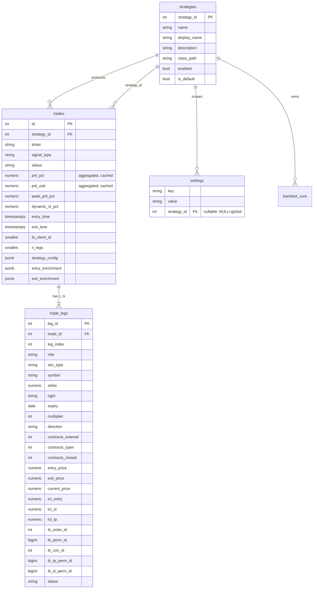
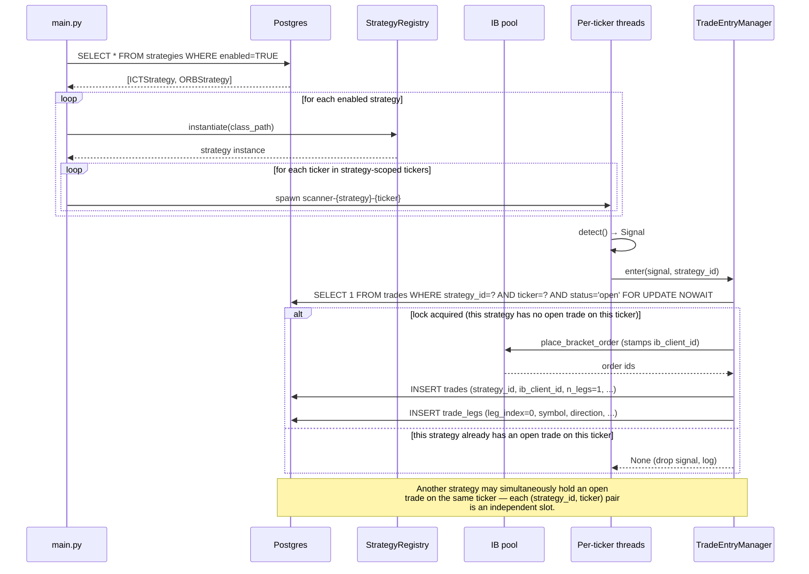
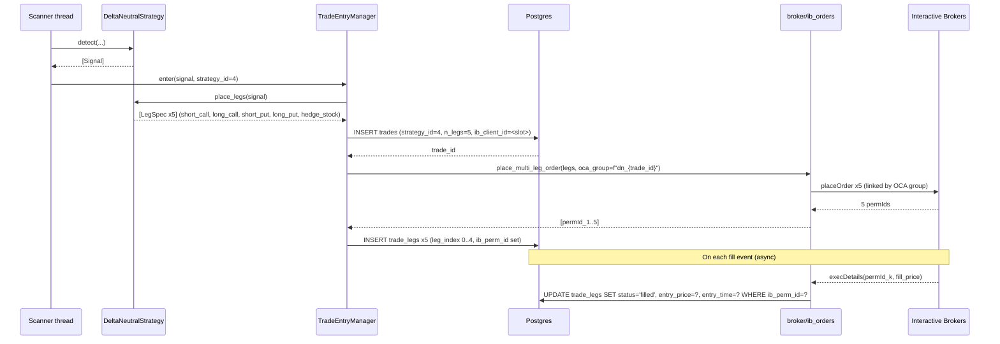

# Multi-Strategy Architecture v2 — Concurrent Strategies + Multi-Leg Trades

**Status:** Proposed target architecture.
**Supersedes near-term:** `docs/active_strategy_design.md` (singleton
`ACTIVE_STRATEGY`). **Reactivates & refines:** `docs/multi_strategy_data_model.md`
(which was deferred). **Prerequisite reading:**
`docs/strategy_plugin_framework.md`, `docs/ib_db_correlation.md` §11,
`docs/thread_owned_close.md`, `docs/close_flow_fixes_2026_04_21.md`,
`docs/delta_neutral_strategy.md`, `docs/ticker_thread_lifecycle.md`,
`docs/system_architecture.md`.

Branch: `feature/profitability-research`.

---

## §1 — Problem statement & goals

Today the bot runs exactly **one** strategy at a time (the `ACTIVE_STRATEGY`
setting), and every trade is a **single option leg**. That's fine for ICT.
It's wrong for:

- Running ICT alongside ORB on SPY concurrently, so we can compare them
  live on the same tape without stopping/starting the bot.
- Delta-neutral strategies (`docs/delta_neutral_strategy.md`) that place
  4 option legs (iron condor) or 4 options + 1 stock hedge.
- Per-strategy settings scoping in the UI (today's Settings tab is
  implicitly "for whatever ACTIVE_STRATEGY is").

### Done looks like

1. Multiple rows in `strategies` can be `enabled=TRUE` at the same
   time. The bot reads that set at boot and spawns per-ticker thread
   sets for each. (`enabled` is the sole activation signal — see §2.1.)
2. A `trade` row is the *logical deal envelope*; its 1..N rows in
   `trade_legs` carry every per-leg field (contract identity, IB ids,
   entry/exit prices, bracket state, ICT levels, etc.). **Every trade
   has at least one leg row** — no partial backward-compat path.
3. Each `(strategy_id, ticker)` pair gets one concurrent-trade slot:
   ICT can be long SPY while ORB is short SPY simultaneously. See §3.3.
4. Settings tab has a strategy dropdown; scoped settings shown as editable,
   globals shown as inherited.
5. Close flow routes through the pool slot (clientId) that placed the
   order, via `trades.ib_client_id` — concretely implementing the
   ARCH-007 "stable clientId routing" idea from
   `docs/ib_db_correlation.md` §11.

### Non-goals

- **Do not widen the tradeable universe.** Ticker list stays as-is.
- **Do not build new strategies in this doc.** ORB / VWAP / delta-neutral
  implementations are separate tracks.
- **Do not rewrite the backtest engine.** It already supports
  strategy-scoped runs via `backtest_runs.strategy_id`; the only
  multi-leg work there is teaching P&L aggregation to sum across legs
  (see §8).
- **Do not relax ARCH-005 / ARCH-006.** Both invariants survive
  intact; §3 extends them, doesn't weaken them.
- **Do not touch the IB connection pool sizing** (4 slots stays fine
  for Phase 2–5; revisit at Phase 6 only if N*M threads saturate the
  submit queue).

---

## §2 — Target data model

All changes ship in one migration: `db/migrations/007_trades_legs_rebuild.sql`.
This is a **big-bang rebuild** of `trades`: the old table is renamed to
`trades_pre_legs` (preserving data + indexes under renamed names), a new
slim `trades` table is created, and `trade_legs` is introduced to carry
every per-leg field. The `ACTIVE_STRATEGY` singleton setting row is
deleted in the same migration. Bot must be stopped during application.

### 2.1 Strategy activation — use `enabled`

No schema change to `strategies`. The existing `enabled` column is the
sole activation signal. At boot the bot runs:

```sql
SELECT * FROM strategies WHERE enabled = TRUE;
```

The singleton `ACTIVE_STRATEGY` setting is deleted (it was always going
to go). `is_default` stays as-is — it's used by the UI to pre-select
the "default" strategy in dropdowns (e.g. Settings-tab scoped views).
We do **not** add an `is_active` column; `enabled` already carries
that meaning and adding a parallel flag would just create a two-source
inconsistency risk.

```sql
DELETE FROM settings
 WHERE key = 'ACTIVE_STRATEGY' AND strategy_id IS NULL;
```

If `ACTIVE_STRATEGY` previously pointed at a disabled strategy, the
migration flips that strategy's `enabled=TRUE` first so behavior
is preserved across the boundary.

### 2.2 `trades` rebuild — envelope only

The new `trades` is the logical **deal envelope**. Every per-leg field
moves to `trade_legs` (§2.3). The columns that stay on `trades`:

| Column              | Notes                                              |
|---------------------|----------------------------------------------------|
| `id`                | PK                                                 |
| `account`           |                                                    |
| `ticker`            | Underlying ticker (for the per-(strategy,ticker) lock) |
| `strategy_id`       | FK                                                 |
| `signal_type`       |                                                    |
| `pnl_pct`           | **Aggregated** across legs, cached for fast reads  |
| `pnl_usd`           | **Aggregated** across legs, cached for fast reads  |
| `peak_pnl_pct`      |                                                    |
| `dynamic_sl_pct`    |                                                    |
| `entry_time`        | First fill across all legs                         |
| `exit_time`         | Last close across all legs                         |
| `status`            | Envelope status (open/closed/cancelled/error)      |
| `exit_reason`       |                                                    |
| `exit_result`       |                                                    |
| `error_message`     |                                                    |
| `notes`             |                                                    |
| `client_trade_id`   |                                                    |
| `ib_client_id`      | Pool slot clientId that placed the entry           |
| `n_legs`            | Cached count of leg rows                           |
| `strategy_config`   |                                                    |
| `entry_enrichment`  |                                                    |
| `exit_enrichment`   |                                                    |
| `created_at`        |                                                    |
| `updated_at`        |                                                    |

Everything else moves off `trades` → onto `trade_legs`.

New table shape:

```sql
CREATE TABLE trades (
    id                SERIAL PRIMARY KEY,
    account           VARCHAR(40),
    ticker            VARCHAR(20) NOT NULL,
    strategy_id       INT NOT NULL REFERENCES strategies(strategy_id),
    signal_type       VARCHAR(40),

    -- Aggregated P&L (cached; canonical value from v_trades_aggregate_pnl)
    pnl_pct           NUMERIC(10,4),
    pnl_usd           NUMERIC(14,2),
    peak_pnl_pct      NUMERIC(10,4),
    dynamic_sl_pct    NUMERIC(10,4),

    entry_time        TIMESTAMPTZ,
    exit_time         TIMESTAMPTZ,
    status            VARCHAR(20) NOT NULL,
    exit_reason       VARCHAR(40),
    exit_result       VARCHAR(40),
    error_message     TEXT,
    notes             TEXT,

    client_trade_id   VARCHAR(64),
    ib_client_id      SMALLINT,             -- pool slot that placed the entry
    n_legs            SMALLINT NOT NULL DEFAULT 1,

    strategy_config   JSONB,
    entry_enrichment  JSONB,
    exit_enrichment   JSONB,

    created_at        TIMESTAMPTZ NOT NULL DEFAULT NOW(),
    updated_at        TIMESTAMPTZ NOT NULL DEFAULT NOW()
);

CREATE INDEX idx_trades_strategy_status ON trades(strategy_id, status);
CREATE INDEX idx_trades_ticker_status   ON trades(ticker, status);
CREATE INDEX idx_trades_client_id       ON trades(ib_client_id)
    WHERE ib_client_id IS NOT NULL;
-- Plus every index that previously existed on trades, recreated here
-- under its original name (so downstream code + EXPLAIN plans are stable).
```

`ib_client_id` is stamped at order placement with the clientId of the
pool connection that submitted the entry order (see
`broker/ib_pool.py:37-40` for the clientId assignment). `n_legs` is a
cached count for UI — avoids a subselect when rendering the Trades tab.

### 2.3 `trade_legs` (new) — carries every per-leg field

Schema accommodates OPT/FOP **and** STK legs (stock hedge needs NULLable
`strike`/`right`/`expiry`). Every trade has ≥1 leg row — single-leg
strategies get exactly one row with `leg_index=0`.

```sql
CREATE TABLE trade_legs (
    leg_id        SERIAL PRIMARY KEY,
    trade_id      INT NOT NULL REFERENCES trades(id) ON DELETE CASCADE,
    leg_index     SMALLINT NOT NULL,       -- 0..N-1, order matters for display
    role          VARCHAR(24),             -- 'primary','short_call','hedge_stock',etc.

    -- Contract identity (moved from trades)
    sec_type      VARCHAR(4) NOT NULL,     -- 'OPT' | 'FOP' | 'STK'
    symbol        VARCHAR(40) NOT NULL,    -- local_symbol for OPT/FOP, ticker for STK
    underlying    VARCHAR(20),             -- underlying ticker (redundant w/ trades.ticker)
    strike        NUMERIC(12,4),           -- NULL for STK
    right         VARCHAR(1),              -- 'C'|'P'; NULL for STK
    expiry        DATE,                    -- NULL for STK
    multiplier    INT NOT NULL DEFAULT 100,
    exchange      VARCHAR(20),
    currency      VARCHAR(8),

    -- Sizing & direction (moved from trades)
    direction          VARCHAR(8) NOT NULL,      -- 'LONG' | 'SHORT'
    contracts_entered  INT NOT NULL,
    contracts_open     INT NOT NULL,
    contracts_closed   INT NOT NULL DEFAULT 0,

    -- Prices (moved from trades)
    entry_price        NUMERIC(10,4),
    exit_price         NUMERIC(10,4),
    current_price      NUMERIC(10,4),
    ib_fill_price      NUMERIC(10,4),
    profit_target      NUMERIC(10,4),
    stop_loss_level    NUMERIC(10,4),

    -- ICT-specific per-leg levels (moved from trades)
    ict_entry          NUMERIC(10,4),
    ict_sl             NUMERIC(10,4),
    ict_tp             NUMERIC(10,4),

    -- IB correlation (moved from trades)
    ib_order_id        INT,
    ib_perm_id         BIGINT,
    ib_con_id          INT,

    -- Bracket state (moved from trades)
    ib_tp_order_id     INT,
    ib_tp_perm_id      BIGINT,
    ib_tp_status       VARCHAR(20),
    ib_tp_price        NUMERIC(10,4),
    ib_sl_order_id     INT,
    ib_sl_perm_id      BIGINT,
    ib_sl_status       VARCHAR(20),
    ib_sl_price        NUMERIC(10,4),
    ib_brackets_checked_at TIMESTAMPTZ,

    -- Execution state
    status        VARCHAR(20) NOT NULL DEFAULT 'pending',  -- pending|filled|cancelled|closed
    entry_time    TIMESTAMPTZ,
    exit_time     TIMESTAMPTZ,

    created_at    TIMESTAMPTZ NOT NULL DEFAULT NOW(),
    updated_at    TIMESTAMPTZ NOT NULL DEFAULT NOW(),

    UNIQUE (trade_id, leg_index)
);

CREATE INDEX idx_trade_legs_trade    ON trade_legs(trade_id);
CREATE INDEX idx_trade_legs_perm_id  ON trade_legs(ib_perm_id)
    WHERE ib_perm_id IS NOT NULL;
CREATE INDEX idx_trade_legs_con_id   ON trade_legs(ib_con_id)
    WHERE ib_con_id IS NOT NULL;
CREATE INDEX idx_trade_legs_tp_perm  ON trade_legs(ib_tp_perm_id)
    WHERE ib_tp_perm_id IS NOT NULL;
CREATE INDEX idx_trade_legs_sl_perm  ON trade_legs(ib_sl_perm_id)
    WHERE ib_sl_perm_id IS NOT NULL;
```

### 2.4 Big-bang migration — loud-failure backup

User-chosen approach: rename the old `trades` to a frozen snapshot,
build the new schema, backfill. We keep `trades_pre_legs` as a frozen
snapshot with its indexes renamed. **Any code that still references
the old column names will now hit SQL errors loudly against the new
`trades` table — there's no silent stale behavior.** Once we've
validated a few days of live running, the backup can be dropped.

```sql
-- Phase A: snapshot everything that structurally changes
ALTER TABLE trades RENAME TO trades_pre_legs;
-- Rename its indexes too so the new table's indexes can use the
-- original names:
ALTER INDEX trades_pkey                 RENAME TO trades_pre_legs_pkey;
ALTER INDEX idx_trades_strategy_status  RENAME TO idx_trades_strategy_status_pre_legs;
ALTER INDEX idx_trades_ticker_status    RENAME TO idx_trades_ticker_status_pre_legs;
-- ... and every other existing index on trades, same pattern.
-- (strategies is not rebuilt — per Revision A+D it doesn't change.)

-- Phase B: create the new slim trades table (§2.2 DDL above).
-- Recreate the expected indexes under their original names.

-- Phase C: create trade_legs table (§2.3 DDL above).

-- Phase D: backfill
INSERT INTO trades (
    id, account, ticker, strategy_id, signal_type,
    pnl_pct, pnl_usd, peak_pnl_pct, dynamic_sl_pct,
    entry_time, exit_time, status, exit_reason, exit_result,
    error_message, notes, client_trade_id, ib_client_id, n_legs,
    strategy_config, entry_enrichment, exit_enrichment,
    created_at, updated_at
)
SELECT
    id, account, ticker, strategy_id, signal_type,
    pnl_pct, pnl_usd, peak_pnl_pct, dynamic_sl_pct,
    entry_time, exit_time, status, exit_reason, exit_result,
    error_message, notes, client_trade_id, ib_client_id, 1 AS n_legs,
    strategy_config, entry_enrichment, exit_enrichment,
    created_at, updated_at
FROM trades_pre_legs;

-- Preserve the id sequence state (so newly-inserted trades don't collide):
SELECT setval(pg_get_serial_sequence('trades','id'),
              (SELECT COALESCE(MAX(id), 0) FROM trades));

INSERT INTO trade_legs (
    trade_id, leg_index, role,
    sec_type, symbol, underlying, strike, right, expiry, multiplier,
    exchange, currency,
    direction, contracts_entered, contracts_open, contracts_closed,
    entry_price, exit_price, current_price, ib_fill_price,
    profit_target, stop_loss_level,
    ict_entry, ict_sl, ict_tp,
    ib_order_id, ib_perm_id, ib_con_id,
    ib_tp_order_id, ib_tp_perm_id, ib_tp_status, ib_tp_price,
    ib_sl_order_id, ib_sl_perm_id, ib_sl_status, ib_sl_price,
    ib_brackets_checked_at,
    status, entry_time, exit_time
)
SELECT
    id, 0 AS leg_index, 'primary',
    COALESCE(sec_type, 'OPT'), symbol, underlying, strike, right, expiry,
    COALESCE(multiplier, 100),
    exchange, currency,
    direction, contracts_entered, contracts_open, contracts_closed,
    entry_price, exit_price, current_price, ib_fill_price,
    profit_target, stop_loss_level,
    ict_entry, ict_sl, ict_tp,
    ib_order_id, ib_perm_id, ib_con_id,
    ib_tp_order_id, ib_tp_perm_id, ib_tp_status, ib_tp_price,
    ib_sl_order_id, ib_sl_perm_id, ib_sl_status, ib_sl_price,
    ib_brackets_checked_at,
    CASE WHEN status IN ('open','closed','cancelled') THEN status ELSE 'filled' END,
    entry_time, exit_time
FROM trades_pre_legs;

-- Phase E: delete ACTIVE_STRATEGY singleton setting (no longer needed)
DELETE FROM settings WHERE key = 'ACTIVE_STRATEGY' AND strategy_id IS NULL;
```

**Post-migration verification** (manual, before unstopping the bot):

```sql
SELECT
    (SELECT COUNT(*) FROM trades_pre_legs) AS pre_legs_count,
    (SELECT COUNT(*) FROM trades)          AS new_trades_count,
    (SELECT COUNT(*) FROM trade_legs)      AS new_legs_count;
-- Expect: pre_legs_count == new_trades_count == new_legs_count
-- (every legacy trade gets exactly one leg row)
```

**Rollback** (companion `007_trades_legs_rebuild_rollback.sql`):

```sql
DROP TABLE trade_legs;
DROP TABLE trades;
ALTER TABLE trades_pre_legs RENAME TO trades;
-- Rename every snapshot index back to its original name:
ALTER INDEX trades_pre_legs_pkey                RENAME TO trades_pkey;
ALTER INDEX idx_trades_strategy_status_pre_legs RENAME TO idx_trades_strategy_status;
ALTER INDEX idx_trades_ticker_status_pre_legs   RENAME TO idx_trades_ticker_status;
-- ... and every other snapshotted index, same pattern in reverse.
-- Finally, re-seed ACTIVE_STRATEGY if your deployment still relies on it.
```

### 2.5 Table rebuild convention

**Whenever this initiative alters a table's structure, we rename the
original to `<table>_pre_legs` (preserving its data + indexes), then
create a fresh table with the new shape and backfill from the snapshot.
Same for indexes — rename the old indexes onto the snapshot table,
recreate new indexes under the original names on the new table. This
forces legacy code to fail loudly instead of silently reading the wrong
schema.**

In this initiative only `trades` is rebuilt; `strategies` and `settings`
are unchanged (Revision D) aside from the single `DELETE` of the
`ACTIVE_STRATEGY` row. Future table-shape changes under this initiative
follow the same convention.

### 2.6 Convenience views

Most read-side code wants either (a) single-leg trades flattened to one
row with leg fields surfaced, or (b) true aggregate P&L summed across
legs. We define two SQL views in the same migration file so the
refactor in Phase 2c has targets to read from:

```sql
-- v_trades_with_first_leg: flattens single-leg trades for backward-compat
-- reads (most Trades-tab queries). Returns one row per trade with the
-- first leg's columns surfaced. For multi-leg trades, shows the first
-- leg + `n_legs` so the UI knows to expand.
CREATE VIEW v_trades_with_first_leg AS
SELECT
    t.*,
    l.leg_id         AS first_leg_id,
    l.sec_type,
    l.symbol,
    l.underlying,
    l.strike,
    l.right,
    l.expiry,
    l.multiplier,
    l.exchange,
    l.currency,
    l.direction,
    l.contracts_entered,
    l.contracts_open,
    l.contracts_closed,
    l.entry_price,
    l.exit_price,
    l.current_price,
    l.ib_fill_price,
    l.profit_target,
    l.stop_loss_level,
    l.ict_entry,
    l.ict_sl,
    l.ict_tp,
    l.ib_order_id,
    l.ib_perm_id,
    l.ib_con_id,
    l.ib_tp_order_id,
    l.ib_tp_perm_id,
    l.ib_tp_status,
    l.ib_tp_price,
    l.ib_sl_order_id,
    l.ib_sl_perm_id,
    l.ib_sl_status,
    l.ib_sl_price,
    l.ib_brackets_checked_at
FROM trades t
LEFT JOIN LATERAL (
    SELECT *
      FROM trade_legs
     WHERE trade_id = t.id
     ORDER BY leg_index ASC
     LIMIT 1
) l ON TRUE;

-- v_trades_aggregate_pnl: sums leg-level pnl into trade-level totals
-- for pages that need the true aggregate (e.g. summary cards, backtest
-- comparisons). Use this rather than the cached trades.pnl_pct/pnl_usd
-- when stale-cache is suspected.
CREATE VIEW v_trades_aggregate_pnl AS
SELECT
    t.id,
    t.strategy_id,
    t.ticker,
    t.status,
    SUM(
        (COALESCE(l.exit_price, l.current_price, 0) - l.entry_price)
        * l.contracts_entered
        * CASE l.direction WHEN 'LONG' THEN 1 ELSE -1 END
        * l.multiplier
    ) AS pnl_usd,
    SUM(l.contracts_entered * l.multiplier * l.entry_price) AS cost_basis_usd
FROM trades t
LEFT JOIN trade_legs l ON l.trade_id = t.id
GROUP BY t.id, t.strategy_id, t.ticker, t.status;
```

The cached `trades.pnl_pct` / `trades.pnl_usd` columns **remain** on the
envelope for fast reads (Trades tab, summary cards hot path). The view
is the authoritative value when stale-cache is suspected — reconciliation
jobs and audit tooling should read from the view and optionally write
back into the cache columns.

### 2.7 `backtest_trades.strategy_id` — verify, don't re-add

`backtest_runs.strategy_id` already exists (confirmed). The migration
checks `backtest_trades` for the column and adds it nullable with a
backfill-from-run if missing; otherwise no-op.

### 2.8 ER diagram



### 2.9 `strategies` columns — no schema change

The existing `strategies` columns — `name` (short code like `ict`),
`display_name` (user-friendly short like "ICT"), and `description`
(long prose) — are sufficient for the UI needs of this initiative. No
schema change to `strategies`. The only tables the migration modifies
are: `settings` (deletes one row), `trades` (full rebuild under §2.4),
and `trade_legs` (new).

---

## §3 — Runtime architecture

### 3.1 Isolation model

Each enabled strategy gets its **own per-ticker thread set**. If ICT
and ORB are both enabled and the ticker universe is 23 symbols, that's 46
scanner threads. Simpler to reason about than multi-plugin-per-thread;
if the thread count later becomes a real cost we revisit.

The IB connection pool (4 slots: exit-mgr + 3 scanner slots A/B/C,
`broker/ib_pool.py:1-10`) is shared — scanner threads multiplex onto
scanner slots via the existing ticker→slot sharding. Per-strategy
isolation is **at the thread/logic layer**, not at the connection
layer.

### 3.2 Boot sequence



### 3.3 Concurrent-trade policy (ARCH-006 extension)

> **One open trade per `(strategy_id, ticker)` pair. Multiple strategies
> may hold open trades on the same ticker simultaneously.**

If ICT is already open on SPY, ORB is **not** blocked from entering SPY
— it gets its own independent slot. So ICT can be long SPY while ORB is
short SPY at the same time.

**Rationale:** Strategies run isolated per user choice #1. Blocking
across strategies would defeat the purpose of running them in parallel
during market hours — the whole point is to observe how many survive
live conditions. Each strategy's `orderRef` (e.g. `ict-SPY-260421-01`
vs `orb-SPY-260421-01`) identifies which position belongs to which
strategy in IB.

The enforcement query (ARCH-002 pattern):

```sql
SELECT 1 FROM trades
 WHERE strategy_id = :sid AND ticker = :ticker AND status = 'open'
 FOR UPDATE NOWAIT;
```

The `(strategy_id, ticker, status='open')` combination is the unit of
contention; each pair gets one slot. Cross-strategy exposure caps
(single-account net delta / gross notional limits) are a **separate
concern** handled outside this doc — see §8 open-questions for the
follow-up.

### 3.4 Close flow is strategy-agnostic

Trades are trades. `strategy/exit_executor.py:_execute_exit_sell_first`
(line 355) and `strategy/exit_manager.py`'s `_atomic_close` don't need
to know who opened the trade. They just:

1. Read `trades.ib_client_id` to pick the pool slot that owns the
   original order.
2. Route the cancel + sell through that slot (§5 of
   `docs/thread_owned_close.md`).
3. Fall back to today's permId fan-out
   (`docs/close_flow_fixes_2026_04_21.md`) if the target clientId
   isn't currently present in the pool (bot restart, pool resize, etc.).

This is the ARCH-007 "stable clientId routing" promise made concrete.

---

## §4 — Plugin interface extensions

Current shape is in `strategy/base_strategy.py:66-108`. We add one
optional method for multi-leg strategies; single-leg plugins keep
working unchanged.

### 4.1 New `LegSpec` dataclass

```python
# strategy/base_strategy.py (additions)
from typing import Literal, Optional

@dataclass
class LegSpec:
    """One order in a multi-leg trade."""
    role: str                        # 'primary', 'short_call', 'hedge_stock', ...
    sec_type: Literal["OPT", "FOP", "STK"]
    symbol: str                      # local_symbol for OPT/FOP, ticker for STK
    side: Literal["BUY", "SELL"]
    contracts: int                   # shares for STK
    strike: Optional[float] = None   # None for STK
    right: Optional[Literal["C", "P"]] = None
    expiry: Optional[str] = None     # YYYYMMDD; None for STK
    order_type: Literal["MKT", "LMT"] = "LMT"
    limit_price: Optional[float] = None
    multiplier: int = 100            # 1 for STK
```

### 4.2 Extended `BaseStrategy`

```python
class BaseStrategy(ABC):
    # ... existing name/description/detect unchanged ...

    def place_legs(self, signal: Signal) -> list[LegSpec]:
        """Describe the orders to place for this signal.

        Default: single leg — one primary option order sized by the
        strategy's `contracts` setting. Multi-leg strategies (iron
        condors, delta-neutral) override this.
        """
        return [LegSpec(
            role="primary",
            sec_type="OPT",
            symbol=signal.details.get("option_symbol", ""),
            side="BUY" if signal.direction == "LONG" else "SELL",
            contracts=signal.details.get("contracts", 1),
            strike=signal.details.get("strike"),
            right="C" if signal.direction == "LONG" else "P",
            expiry=signal.details.get("expiry"),
            order_type="LMT",
            limit_price=signal.entry_price,
        )]
```

`TradeEntryManager.enter()` (`strategy/trade_entry_manager.py:215`)
branches:

```python
legs = strategy.place_legs(signal)
if len(legs) == 1:
    return self._enter_single_leg(signal, legs[0])   # today's path
return self._enter_multi_leg(signal, legs)           # new, §6
```

Backward compat: every existing strategy that never overrides
`place_legs` continues to use today's bracket path.

---

## §5 — Settings UI scoping

Minimal UI surface change. Layout:

```
Settings tab
┌──────────────────────────────────────────────────────────┐
│ Viewing settings for:  [ ICT ▾ ]   (enabled strategies   │
│                                     only — ORB, ICT)     │
├──────────────────────────────────────────────────────────┤
│ PROFIT_TARGET         [ 0.30 ]            (ICT-scoped)   │
│ STOP_LOSS             [ 0.50 ]            (ICT-scoped)   │
│ ROLL_THRESHOLD        0.20 (grey)  [inherited: global]   │
│ IB_HOST               (grey)       [inherited: global]   │
│ …                                                        │
│                                                          │
│                              [ Save (writes to ICT) ]    │
└──────────────────────────────────────────────────────────┘
```

Rules:

- Dropdown lists `strategies WHERE enabled=TRUE`, pre-selecting the
  row with `is_default=TRUE` (falls back to lowest `strategy_id` if
  no default is marked).
- Scoped rows (`WHERE strategy_id = :sid`) render editable.
- Global rows (`WHERE strategy_id IS NULL`) with no scoped override
  render greyed out with an "inherited" pill.
- Save always writes with `strategy_id = selected_id` — never
  accidentally upgrades a global to a per-strategy row until a user
  explicitly edits it.

Backend already resolves the chain (strategy > global > env > default)
in `db/settings_loader.py::_settings_query` — verify that function still
works unchanged and add a thin route `GET /api/settings?strategy_id=<id>`
that returns both the scoped rows and the globals for display.

---

## §6 — Multi-leg execution

The worked example is an iron condor: 4 option legs, all OPT, submitted
as a single combo with a shared OCA group. Delta-neutral iron condor
adds a 5th STK hedge leg.

### 6.1 Entry sequence



### 6.2 `place_multi_leg_order` signature

New method on `broker/ib_orders.py`:

```python
def place_multi_leg_order(
    self,
    legs: list[LegSpec],
    oca_group: str,
    oca_type: int = 1,               # 1 = CANCEL_WITH_BLOCK
    parent_client_id: int | None = None,
) -> list[dict]:
    """Submit N orders atomically, linked by oca_group.

    Returns one dict per leg: {ib_order_id, ib_perm_id, ib_con_id,
    symbol, status}. Caller (TradeEntryManager) persists to trade_legs.

    Raises if any leg fails validation before submission; best-effort
    cancels on any leg that submits then reports an IB error before
    the batch is complete.
    """
```

Reuses the same `_submit_to_ib()` mechanics as `place_bracket_order`
(see `strategy/option_selector.py:180`) — this is not a new IB
transport, just a new batching wrapper.

### 6.3 P&L aggregation

```sql
-- Per-trade P&L
SELECT t.id,
       SUM(
         (COALESCE(l.exit_price, 0) - l.entry_price)
         * l.contracts
         * CASE l.side WHEN 'BUY' THEN 1 ELSE -1 END
         * l.multiplier
       ) AS net_pnl
  FROM trades t
  JOIN trade_legs l ON l.trade_id = t.id
 WHERE t.id = :trade_id
 GROUP BY t.id;
```

Single-leg trades still aggregate correctly (one row, same formula).
The backtest engine gets this same aggregate expression; no code
change beyond swapping the per-trade query.

### 6.4 Close flow for multi-leg

`_atomic_close` iterates `trade_legs WHERE trade_id=? AND status='filled'`
and closes each leg through the pool slot identified by
`trades.ib_client_id`. STK legs use `sell_stock`; OPT/FOP legs use
`sell_call`/`sell_put`. All legs succeed or all rollback — same ARCH-005
semantics, applied leg-by-leg under the single row-level trade lock.

---

## §7 — Migration path & phasing

This is now a bigger migration than originally phased — the `trades`
table is rebuilt (§2.4) rather than extended. Phases 3–6 remain
independently shippable after Phase 2 lands.

### Phase 2a — DB migration (big-bang)
- Ship `db/migrations/007_trades_legs_rebuild.sql`: the renaming +
  rebuild described in §2.4, plus the two views from §2.6.
- **Bot must be stopped during application.** This is not a zero-
  downtime migration.
- Apply in a single transaction where possible; the `ALTER TABLE ...
  RENAME` chain is fast but requires no live writers.
- **Verify post-migration:** `SELECT COUNT(*)` on `trades` and
  `trade_legs` both equal the pre-migration count on
  `trades_pre_legs`; confirm `trades_pre_legs` is frozen (no FKs
  pointing at it from the new schema, no writers targeting it).
- **Rollback:** run `007_trades_legs_rebuild_rollback.sql` — drops the
  new `trade_legs` + `trades`, renames `trades_pre_legs` back to
  `trades`, renames indexes back.

### Phase 2b — ORM + writer refactor
- Update `db/models.py` to reflect the new schema; add a `TradeLeg`
  model.
- Refactor `db/writer.py::insert_trade` to write **one** `trades` row
  + **N** `trade_legs` rows in a single transaction (single-leg path
  writes exactly one leg row with `leg_index=0`).
- Update every `UPDATE trades SET <per-leg-column>=...` call site to
  target `trade_legs` instead. Legacy references will fail loudly
  against the new slim `trades` table — good.
- **Rollback:** revert the writer bundle; DB schema stays on v2.

### Phase 2c — Read-side refactor
- Every route/module that reads trade fields now either joins
  `trade_legs` or reads from one of the two views:
  - `v_trades_with_first_leg` — for the Trades tab and other places
    that expect a flat row shape (single-leg path stays ergonomic).
  - `v_trades_aggregate_pnl` — for summary cards, backtest comparisons,
    and anywhere we want the true cross-leg aggregate rather than the
    cached `trades.pnl_*` columns.
- Views are created in the same migration file as a follow-up block
  after the Phase-D backfill.
- **Rollback:** revert the route bundle; views + tables stay in place.

### Phase 3 — UI scoping + Trades tab leg expansion
- Settings tab dropdown + inherited/scoped rendering (unchanged from
  the pre-rev plan). Dropdown pre-selects the row with
  `is_default=TRUE`.
- Trades tab: single-leg rows render unchanged (read via
  `v_trades_with_first_leg`). Multi-leg trades get an expand row
  showing each leg (`contracts_entered`, `entry_price`, `exit_price`,
  `status` per leg).
- `GET /api/settings?strategy_id=<id>` route.
- **Rollback:** revert frontend + API bundle; DB unaffected.

### Phase 4 — Scanner plugin dispatch
- `strategy/scanner.py:96` stops hardcoding `SignalEngine`.
- `main.py` reads `SELECT * FROM strategies WHERE enabled=TRUE` and
  spawns per-strategy thread sets.
- `TradeEntryManager` stamps `trades.strategy_id` (already FK) and
  passes `strategy_id` down the entry path. Lock query now uses the
  `(strategy_id, ticker, status='open')` form (§3.3).
- **Rollback:** disable all but one strategy via `enabled=FALSE`; old
  single-strategy path still works because nothing got deleted.

### Phase 5 — Thread-owned close via `trades.ib_client_id`
- `TradeEntryManager` writes `trades.ib_client_id = <pool slot clientId>`
  at order placement.
- `_atomic_close` + sidecar `/close-trade` read this column and route
  through that specific slot; permId fan-out stays as fallback.
- **Rollback:** revert close code; `ib_client_id` column can stay
  populated harmlessly.

### Phase 6 — Multi-leg execution + delta-neutral plugin
- The schema already supports multi-leg (shipped in Phase 2a). This
  phase is purely code:
  - `LegSpec` + `BaseStrategy.place_legs` default impl.
  - `broker/ib_orders.py::place_multi_leg_order` submit path.
  - `TradeEntryManager._enter_multi_leg` branch.
  - Delta-neutral plugin code; goes live against paper first.
- **Rollback:** strategies stop overriding `place_legs`; single-leg
  path unaffected.

**Total DDL footprint:**
- **1 table rebuilt** (`trades`, via rename-to-snapshot + recreate).
- **1 table added** (`trade_legs`).
- **1 snapshot table retained** (`trades_pre_legs`, frozen; dropped
  manually after validation window).
- **2 views added** (`v_trades_with_first_leg`,
  `v_trades_aggregate_pnl`).
- **1 settings row deleted** (`ACTIVE_STRATEGY`).
- **1 column verified** (`backtest_trades.strategy_id`, added if
  missing).
- **No changes to `strategies`.**

---

## §8 — Open questions & deferred items

1. **Priority among enabled strategies?** Not currently needed —
   §3.3's per-`(strategy_id, ticker)` slot means strategies don't
   compete with each other for the same row-level lock. If we later
   need deterministic tie-breaking (e.g. shared risk budget), we'd
   add `strategies.priority SMALLINT NOT NULL DEFAULT 0`. Deferred
   until we actually hit a contention pattern that warrants it.

2. **Stock hedge clientId separation?** Delta-neutral's STK leg most
   naturally rides the same pool slot as the options legs, so
   `trades.ib_client_id` routes the whole deal cleanly. We only
   reconsider if TWS rejects cross-sec-type batches on one clientId.

3. **Backtest multi-leg support.** The backtest engine stays single-leg
   for Phase 6. Multi-leg strategies backtest via external P&L-curve
   tooling against historical option chains; wiring the backtest
   engine to multi-leg P&L is a separate follow-up. Does not block
   Phase 6 shipping to live paper.

4. **Per-strategy commission accounting.** Today commissions are
   tracked on `trades` in aggregate. When we want per-strategy cost
   breakdowns we'll split commissions onto `trade_legs.commission`
   and aggregate up. Future work.

5. **Trades-tab strategy provenance.** Add a `strategy` column
   (chip-colored by `strategies.name`) and a filter dropdown. Also
   add `n_legs` as a small badge (e.g. "5L" for iron condor + hedge)
   so users can spot multi-leg deals at a glance. Wire in Phase 3.

6. **Cross-strategy exposure cap (single-account net delta / gross
   notional limits).** With §3.3's per-`(strategy_id, ticker)` policy,
   two strategies can simultaneously hold opposing or reinforcing
   positions on the same ticker. Net account exposure is therefore
   *unbounded by this doc*. A separate initiative needs to add:
   - a `MAX_CONCURRENT_CONTRACTS_PER_TICKER` (cross-strategy sum) cap,
   - optional net-delta and gross-notional limits at the account level,
   - a pre-trade check in `TradeEntryManager` that rolls up
     `SUM(contracts_open)` across all open legs on the ticker before
     admitting a new entry.
   Flagged here as a **deferred follow-up**, explicitly out of scope
   for the multi-strategy v2 initiative.

7. **Dropping `trades_pre_legs`.** The snapshot table is kept indefinitely
   post-migration so any stale legacy code paths trip on missing columns
   loudly rather than silently. Drop it manually (not via migration)
   after a validation window — suggested: one full trading week of clean
   live running with no production errors traceable to the schema change.
