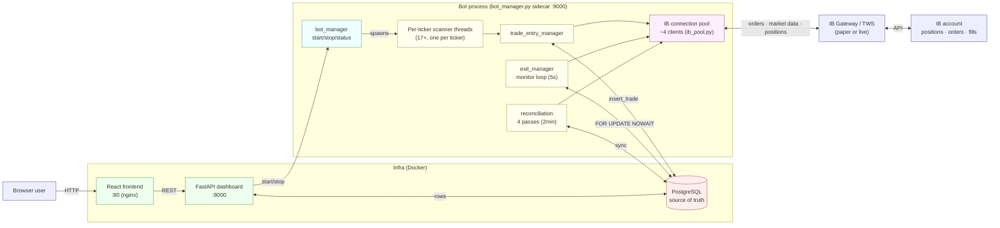
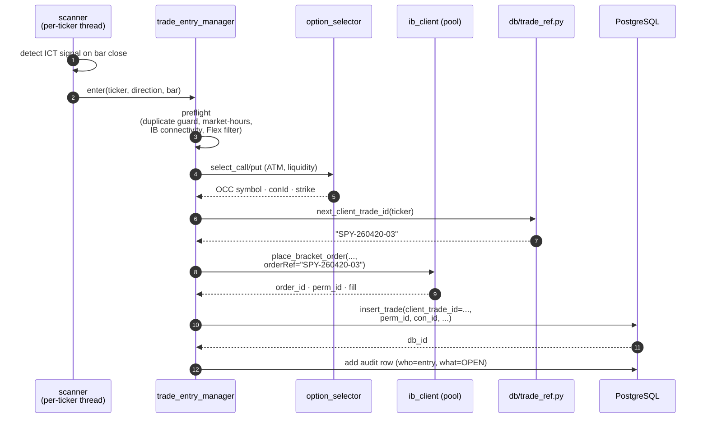
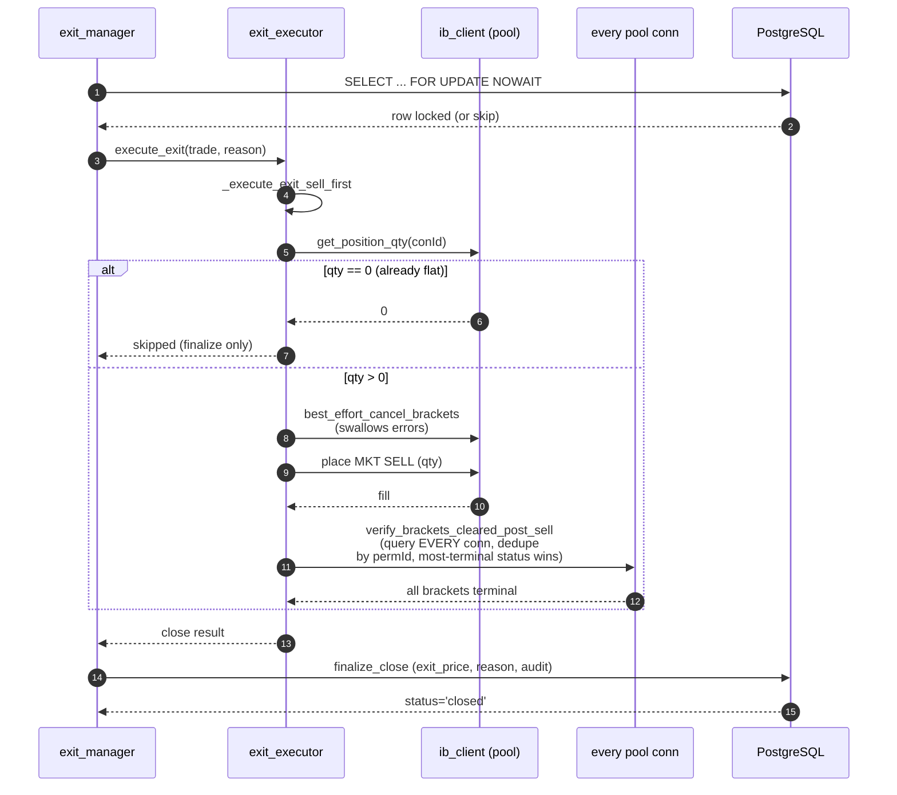
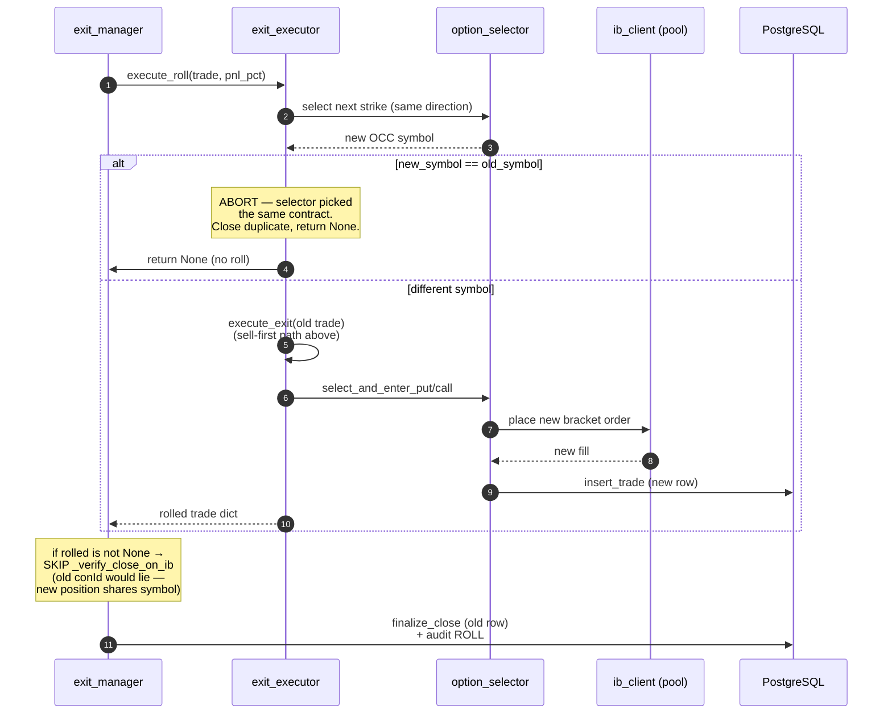
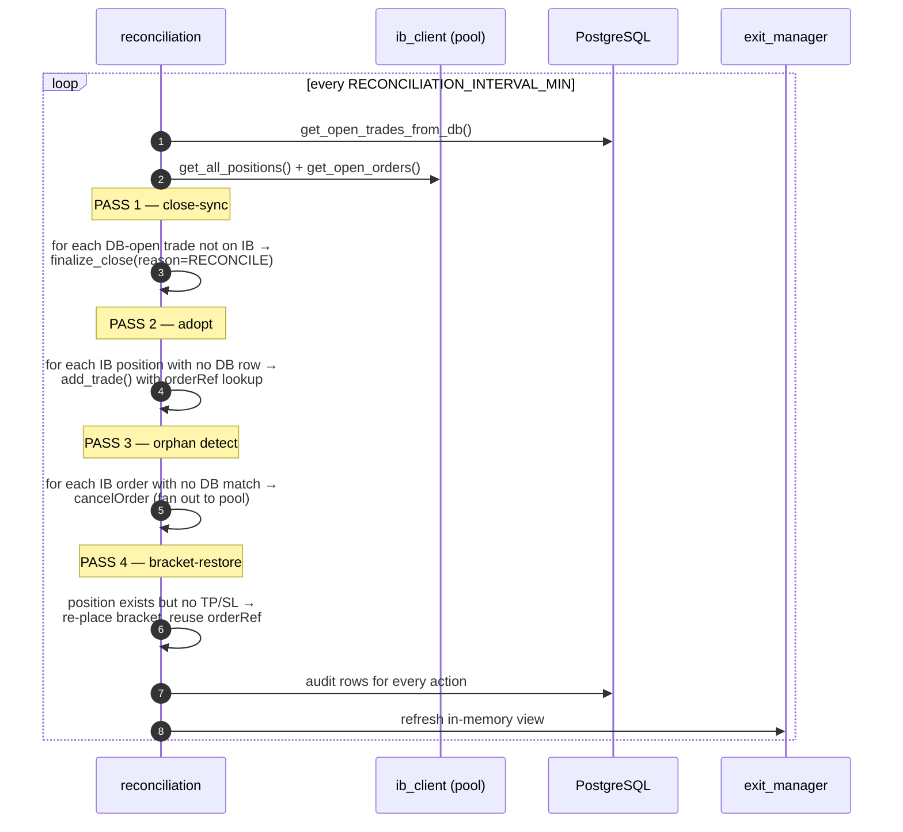

# System Architecture

> Scope: this doc is the onboarding-level map of the ICT options-trading bot as
> it stands on `feature/profitability-research`. It is **opinionated, not
> exhaustive** — when you need depth, follow the cross-links. The target
> audiences are (a) a new contributor getting their bearings, (b) anyone
> planning the upcoming merges of the four live worktrees, and (c) on-call
> pattern-matching when something breaks in production.

Related deep-dives:

- `docs/ticker_thread_lifecycle.md` — per-ticker thread state machine
- `docs/ib_db_correlation.md` — `orderRef` / `client_trade_id` linkage
- `docs/close_flow_fixes_2026_04_21.md` — latest incident post-mortem
- `docs/bracket_cancel_strict_verification.md` — "assume nothing" on cancels
- `docs/roll_close_bug_fixes.md` — why rolls skip close-verification
- `docs/logging_and_audit.md` — audit-trail schema keyed by `db_id`

---

## 1. System Context

*The bot is a single Python process (`main.py`) wrapped by `bot_manager.py`, a
FastAPI sidecar on :9000 that the dashboard uses for start/stop. Scanners,
entry, exit, and reconciliation are all threads sharing one IB connection
pool — every outbound IB call is submitted to a pool client, never to a raw
socket. Code entry points: `bot_manager.py`, `main.py`, `broker/ib_pool.py`,
`dashboard/app.py`.*

---

## 2. Per-ticker thread lifecycle

See `docs/ticker_thread_lifecycle.md` — it covers the opens/monitors/closes/rolls
state machine one ticker at a time, which is where most operational bugs
actually live. No point duplicating it here.

---

## 3. Four runtime write-paths

The four sequences below are the only paths that **mutate the IB account or
the `trades` DB row**. Everything else is read-only. If a production incident
doesn't fit into one of these four lanes, you're looking at the wrong code.

### 3.1 Entry — scanner signal to persisted trade

*Entry happens once per signal per ticker. The `orderRef` stamp
(`TICKER-YYMMDD-NN`, human-readable) is the single correlation key that lets
reconciliation later find this IB order without ambiguity — see
`docs/ib_db_correlation.md`. If `insert_trade` fails after the order is live,
reconciliation PASS 2 will adopt it on the next cycle. Files:
`strategy/trade_entry_manager.py`, `strategy/option_selector.py`,
`broker/ib_client.py` (`place_bracket_order`), `db/trade_ref.py`,
`db/writer.py` (`insert_trade`).*

### 3.2 Close — sell-first mode

*Sell-first is enabled by `CLOSE_MODE_SELL_FIRST=true` (now default). The
critical twist is **pool-aware bracket verification**: bracket orders can sit
on a client that isn't the one doing the cancel, so we query all ~4 pool
connections, dedupe rows by `permId`, and take the most-terminal status
(`Cancelled`/`Filled` beats a stale `Submitted`). This was the fix for the
2026-04-21 stale-cache false positive. Files: `strategy/exit_manager.py`,
`strategy/exit_executor.py` (`_execute_exit_sell_first`,
`verify_brackets_cleared_post_sell`), `broker/ib_client.py`,
`db/writer.py` (`finalize_close`). See
`docs/bracket_cancel_strict_verification.md` and
`docs/close_flow_fixes_2026_04_21.md`.*

### 3.3 Roll — close old + open new, atomically

*The same-symbol guard is a recent fix — without it, a roll whose selector
returns the original strike would send a SELL then an immediate BUY on the
same `conId`, and the next loop would see it as a "new" open and roll again
(SPY churn loop 2026-04-21). The other load-bearing rule: **after a roll,
skip `_verify_close_on_ib`** because the old `conId` is the same one we just
re-bought — a post-roll position check would report "still open" even though
the original trade is logically closed. Full incident write-up in
`docs/close_flow_fixes_2026_04_21.md`; prior roll bugs in
`docs/roll_close_bug_fixes.md`. Files: `strategy/exit_executor.py`
(`execute_roll`), `strategy/option_selector.py`,
`strategy/trade_entry_manager.py`.*

### 3.4 Reconcile — four-pass DB ↔ IB sync

*Four passes, in this order, every cycle. PASS 1 trusts IB (if IB says flat,
DB is wrong). PASS 2 trusts IB (if IB has a position we never recorded, we
adopt it). PASS 3 is the orphan detector — IB order with no matching DB
trade gets cancelled via pool fan-out (cross-client cancel works, single-client
cancel often doesn't — see `ib_db_correlation.md` §11). PASS 4 is
defense-in-depth: if a position exists without protective brackets, re-place
them reusing the original `orderRef` so future passes recognize them. Files:
`strategy/reconciliation.py`, `strategy/orphan_detector.py`.*

---

## 4. Merge plan for the four worktrees

All four branches fork (directly or transitively) off `feature/dashboard`.
`feature/profitability-research` is the most advanced branch and already
contains much of what the other two started (ENH-019 backtest A-D, ENH-024
strategy plugin scaffolding) — but in its own form, not identical to the
sibling branches. The merges will be messier than they look on the surface.

### 4.1 What each branch adds

- **`feature/dashboard` (baseline, `C:\src\trading\ict-bot`)** — current
  production baseline. Adds the Tests tab (`ARCH-004`: dashboard Run Tests
  button, test history DB, concurrency/race suite) and an overnight status
  summary. This is the merge target via `profitability-research`.

- **`feature/arch-003-ib-client-split` (`C:\src\trading\ict-bot-arch003`)** —
  Phase 2 of ARCH-003. Splits `broker/ib_client.py` (~1,200 LOC monolith) into
  a thin facade plus mixin modules: `broker/ib_orders.py` (~373 LOC),
  `broker/ib_market_data.py` (~177), `broker/ib_positions.py` (~126). Facade
  shrinks from 1,211 to 166 LOC. Adds `tests/unit/test_ib_client_api_parity.py`
  + fixture manifest to lock in the public surface. Also includes the pre-market
  Monday checklist and a one-commit strategy-plugin rollout (strategies table
  + auto-stamped FKs in `insert_trade`).

- **`feature/enh-019-backtest` (`C:\src\trading\ict-bot-backtest`)** — minimal
  backtest skeleton: new `backtest/` package (`fill_model.py`, `metrics.py`),
  `db/backtest_schema.sql`, routes registered in `dashboard/app.py`, and a
  corresponding frontend tab. Strictly additive at the file level. **Note**:
  `feature/profitability-research` already contains a much more advanced
  backtest implementation under `backtest_engine/` — this branch is
  effectively superseded.

- **`feature/profitability-research` (ACTIVE,
  `C:\src\trading\ict-bot-strategies`)** — the big one. Profitability +
  operational hardening:
  - Correlation-ID / `orderRef` stamping (`db/trade_ref.py`, `client_trade_id`
    migration 005), sell-first close mode, cross-client cancel fan-out,
    pool-aware bracket verification, EOD/market-hours guards, orphan detector
    fast-path, bracket rollback, strict cancel verification.
  - Full `backtest_engine/` with Black-Scholes pricer, IB historical data
    provider, sweep framework, analytics tab with cross-run slice/dice.
  - Strategy plugin framework (`strategy/base_strategy.py`, ORB, VWAP,
    strategies table + scoped settings, Strategies tab).
  - FOP foundation (futures-options seeds, schema extensions).
  - Live-trading log visibility, per-thread log viewer upgrades, audit trail
    (`strategy/audit.py`).

### 4.2 File-level overlap (conflict hotspots)

Files touched by more than one non-baseline branch, with severity:

| File | arch003 | backtest | profitability | Severity |
| --- | --- | --- | --- | --- |
| `broker/ib_client.py` | rewrite (facade) | — | modified (cross-client cancel, pool fan-out, sell-first) | **HIGH** |
| `db/writer.py` | modified | — | modified (orderRef, audit, finalize_close) | **HIGH** |
| `db/models.py` | modified | modified | modified | **MEDIUM** |
| `db/active_strategy_schema.sql` | added | — | added | **MEDIUM** (same file, likely overlapping DDL) |
| `db/strategy_writer.py` | added | — | added | **MEDIUM** |
| `db/backtest_schema.sql` | — | added | added (richer) | **MEDIUM** (take profitability's) |
| `dashboard/app.py` | — | modified (register routes) | modified (register routes) | **LOW** (both append routers) |
| `dashboard/frontend/src/App.tsx` | — | modified (add tab) | modified (add tabs) | **LOW** |
| `tests/integration/test_db_locking_races.py` | added | added | added | **MEDIUM** |
| `tests/integration/test_strategies_schema.py` | added | — | added | **MEDIUM** |
| `.claude/CLAUDE.md` | added | added | — | **LOW** |

Not overlapping (additive-only on profitability side): `strategy/audit.py`,
`strategy/exit_executor.py`, `strategy/orphan_detector.py`,
`backtest_engine/*`, `db/trade_ref.py`,
`dashboard/frontend/src/components/BacktestTab.tsx`,
`dashboard/frontend/src/components/StrategiesTab.tsx`,
the TradeTable `Ref` column, and all new docs in `docs/`.

### 4.3 Recommended merge order

**1. `feature/profitability-research` is already the trunk.** Treat it as
the base and merge the others *into* it, not vice versa. It has the most
commits, the most tests, and the most production fixes — anything merged
on top must not regress it.

**2. Merge `arch-003-ib-client-split` FIRST.** Rationale:
- It's a structural refactor; the longer it sits, the worse the drift.
- `ib_client.py` is the single biggest collision point and only arch003
  touches it in a structural way. All other collisions are content-level.
- Resolution strategy: **keep arch003's file split**, then port
  profitability's behavioral changes (sell-first, pool fan-out, cross-client
  cancel) into the new `broker/ib_orders.py` / `broker/ib_market_data.py` /
  `broker/ib_positions.py` modules. The facade at `broker/ib_client.py`
  should just re-export. The API parity test
  (`tests/unit/test_ib_client_api_parity.py`) is the safety net — run it
  after the merge; if it passes, no caller broke.
- `db/writer.py`, `db/models.py`, `db/active_strategy_schema.sql`,
  `db/strategy_writer.py`: take the union. Both branches independently
  introduced the strategies table via ENH-024; confirm the `CREATE TABLE`
  statements are compatible and merge any missing columns.

**3. Merge `enh-019-backtest` SECOND — or skip it.** Rationale:
- Nearly everything it adds, profitability-research already has in a more
  mature form (`backtest_engine/` vs. `backtest/`). The only net-new
  content is `dashboard/frontend/src/components/TestsTab.tsx` + test-history
  schema — which is actually borrowed from the dashboard branch anyway.
- Recommended action: **cherry-pick the Tests-tab / test-history pieces
  only**, and drop the rest of the branch. Do not merge the whole branch —
  it will conflict with the richer `backtest_engine/` and its schema.

**4. Close out.** After both merges, `feature/profitability-research` has
everything. Run the full pytest suite (unit + integration + concurrency)
and the dashboard Tests tab before opening the merge PR to `main`.

### 4.4 Conflict hotspots + resolution

- **`broker/ib_client.py`** — take arch003's split; reimplement profitability's
  behavior (sell-first, cross-client cancel, `orderRef` stamping on
  `place_bracket_order`) inside the new sub-modules. Verify with
  `test_ib_client_api_parity.py` + `test_cross_client_cancel.py` +
  `test_close_sell_first.py`.
- **`db/writer.py`** — manual merge: profitability adds
  `insert_trade(client_trade_id=...)`, audit writes, and `finalize_close`
  SQL-cast fix. Arch003 adds auto-stamp of strategy FK. Both changes are
  compatible; keep both paths.
- **`db/models.py` / `db/active_strategy_schema.sql` /
  `db/strategy_writer.py`** — these came from ENH-024 in both branches.
  Diff them, take the superset. Re-run
  `tests/integration/test_strategies_schema.py` to confirm.
- **`dashboard/app.py`** — both branches register routers. Keep all
  `app.include_router(...)` calls.
- **`tests/integration/test_db_locking_races.py`** — both branches added this
  file. Take the union of test cases.
- **`.claude/CLAUDE.md`** — prefer profitability's version (includes the
  "assume nothing" principle + test discipline rules).

---

## 5. Architecture principles

All source: `docs/backlog.md`. Summarized here for pattern-matching.

**ARCH-001 — Database is the single source of truth.** No in-memory state
decisions. Every component reads fresh from PostgreSQL every cycle. `open_trades.json`
is dead. The one exception is transient caches for read-only UI views, which
never feed back into decisions. If you catch yourself writing
`self.open_trades.append(...)` as authoritative state, stop — that's a bug.
**Status: implemented.**

**ARCH-002 — Row-level locking for state transitions.** Every `close_trade`,
`execute_roll`, dashboard-initiated close, and reconciliation write takes
`SELECT ... FOR UPDATE NOWAIT` on the `trades` row first. NOWAIT means
"if someone else has it, skip and retry next cycle" — we never block the
monitor loop. This is what makes the four write-paths in §3 safe to run
concurrently. **Status: implemented.**

**ARCH-003 — Clean, small, reusable components.** `ib_client.py` at ~1,200
LOC is the last big monolith; `feature/arch-003-ib-client-split` finishes
it (facade + orders + market_data + positions + contracts, each <400 LOC).
Rules: <200 LOC per module where practical, no circular imports, all DB
access via `db/writer.py`, all IB access via the pool. **Status: partial —
final phase pending the arch003 merge (§4).**

**ARCH-004 — Automated regression test suite.** Every bug fix ships a test
that would have caught it. Unit tests for pure logic, integration tests
(real Postgres) for DB behavior, concurrency tests for race conditions
(`tests/unit/test_concurrency.py` is the pattern). Dashboard "Tests" tab
runs all three categories and records results to `test_history` for
regression tracking. **Status: implemented; enforcement is cultural
(see CLAUDE.md).**

**ARCH-005 — Single close authority.** Exactly one function closes trades:
`exit_manager._atomic_close()`, which is the only caller of
`execute_exit()` / `close_position_on_ib()`. Everything else — bracket TP/SL
firing on IB, dashboard Close button, reconciliation PASS 1, EOD sweep —
funnels through here. If we later find a position already flat on IB, we
don't send a redundant SELL; we just `finalize_close()` the DB row. This is
what prevents naked shorts from double-close races.
**Status: implemented and enforced.**

**ARCH-006 — Single open authority.** Mirror of ARCH-005 for opens:
`exit_manager.add_trade()` is the only DB insert. Scanner entries, rolls,
and reconciliation adoptions all go through it; it does a pre-insert check
for an existing open row on the same `ticker` + `conId` to stop duplicates
at the DB layer. **Status: implemented.**

**ARCH-007 — Stable clientId routing (proposed, deferred).** Today, the IB
connection pool hands out whichever of ~4 clientIds is free, so the cancel
for an order placed on client 11 might be issued from client 13 —
IB's cross-client cancel behavior is inconsistent, which is why we need
sell-first close mode, pool fan-out, and pool-wide bracket verification.
The proposed fix: pin pool slots to deterministic clientIds (10–13),
persist `trades.ib_client_id` at entry, and route every future
cancel/modify to the owning client. Would delete ~200 LOC of workaround
code in `exit_executor.py` and `reconciliation.py`. Lower priority now
that sell-first ships. Full design: `docs/ib_db_correlation.md` §11 +
`docs/thread_owned_close.md`. **Status: proposed / deferred.**
